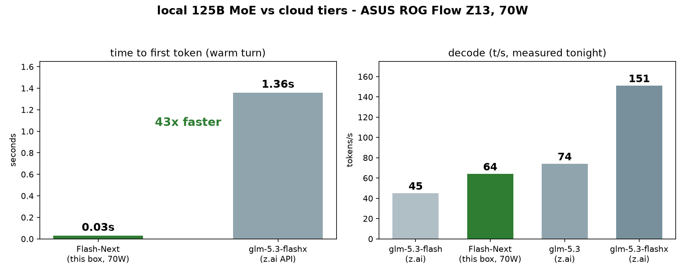

# The pi coding harness for local coding on Strix Halo

The model was never the hard part. This is everything around it that makes a local coding agent actually usable day to day: one-command setup, crash recovery that survives a killed server, NPU-accelerated codebase search, a sidecar model for compaction and commits, and the launch scripts. Every script here is what I actually run.

Two supported stacks:

| stack | what | when |
|---|---|---|
| **halogen** (recommended) | closed-source NPU+GPU engine, Qwen3.8-Flash-Next, local checkpoint, zero network at launch | you want it to just work; 262k ctx x 4 slots default |
| **llama.cpp (Vulkan)** | Nathan's strix-halo builds, full control, DFlash2/MTP spec decode, vision, up to 256k ctx | you want to tune everything / reproduce the ladder numbers |

Every number in this README is measured and logged: **[the full benchmark numbers](docs/BENCHMARKS.md)** holds the receipts, and **[Flash-Next vs GLM 5.3: local vs cloud on a real debugging task](docs/local-vs-cloud-model-comparison.md)** is the six-run head-to-head, answers rated against verified ground truth.



Measured on an ASUS ROG Flow Z13 (Ryzen AI MAX+ 395, Radeon 8060S, 128GB) at 70 W sustained.

## Contents

[Install](#install) | [Quickstart: halogen](#quickstart-halogen) | [Crash recovery](#crash-recovery) | [Uninstall](#uninstall) | [Upgrading halogen](#upgrading-halogen) | [Using another engine](#using-another-engine-gufo-llamacpp-as-the-main-model) | [llama.cpp path](#setup-llamacpp-path-full-control) | [Troubleshooting](#troubleshooting) | [Docs](#docs) | [Posts](#posts)

## Repo map

- **`setup.sh`** - one command, idempotent: extensions, providers, sidecar fetch, keep-alive unit, halogen launch, memory check. Touches nothing you configured yourself; probes and reports what's live.
- **`start.sh <dir>`** - the daily command: heals any dead server, then drops you into the pi TUI.
- **`extensions/`** - ten extensions, each earning its place by measurement:
  - `progress-tracker` - crash recovery checkpointing
  - `npu-retrieval` - `codebase_search` + `/rag-index` (semantic search, ~0.2-1.3s on 0.17.1; first call after a reboot loads the NPU models)
  - `ling-tiny-compaction` / `ling-tiny-commit` / `ling-tiny-branch-summary` / `ling-tiny-repomap` - the sidecar suite (compaction is non-blocking with thinking off and 10/10 rule retention; the repomap is freshness-cached)
  - `auto-guard` - injection screening, fail-open tripwire (42% recall / 0% false positives on our 30-prompt canary)
  - `harness-tune` (`/tune`), `turn-timer`, `subagent/` (worker/scout/reviewer/planner, session-model inheritance)

  - measured no-ops live in `extensions/optional/` with their receipts; details in `extensions/README.md`.
- **`rag-index.py` / `rag-query.py`** - NPU retrieval toolkit: chunk + embed a repo with qwen3-embedding-0.6b on the NPU (~5-6k tok/s), cosine top-k + NPU rerank. Incremental (mtime-based). Runs standalone or through the extension.
- **`server/`** - llama.cpp-path launch scripts: `start-flashnext.sh` (MTP sidecar, the reasoning flags that stop it burning its whole output on thinking), `start-qwen38.sh` (27B, DFlash2, 256k ctx), `start-ling-tiny.sh` (aux). Ubatch ceiling documented in headers.
- **`config/`** - `models.json.example` (llama.cpp path, both models pre-wired) and the compaction snippet (`reserveTokens` is per-model, don't copy it blindly; `maxTokens` must be ≤8192 or the server 400s past ~32.7k ctx).
- **`bench/`** - `harness-ab.sh` (baseline vs kill+resume A/B, one command), `report-accuracy.py` (grade every file:line claim in a report against the tree), `check-sidecar.sh`, `guard-canary.py` + `compaction-retention.py` (the measurement canaries).
- **`templates/`** - pi prompt templates: `/gauntlet` (multi-phase stress session that crosses the compaction trigger) and `/speedtest` (9-probe engine benchmark with pass/fail bands).

## Quickstart: halogen

Prerequisites: an AMD Strix Halo box (gfx1151), docker, the [pi coding agent](https://github.com/earendil-works/pi), and the halogen model files from [huggingface.co/peonist-ai/halogen-qwen3.8-flash-next](https://huggingface.co/peonist-ai/halogen-qwen3.8-flash-next).

Minimum download (~124 GB total - don't grab the whole repo, it carries ~190 GB of optional variants):

| file | size | why |
|---|---|---|
| `qwen38-flash-next-v2.hgn` | 66.7 GB | the main checkpoint (MTP drafter head included) |
| `qwen38-flash-next-ngram.hgn` | 51.2 GB | **required** - the checkpoint's weight lookup table (read through the page cache; not an n-gram drafter despite the name) |
| `qwen38-flash-next-vision.hgn` | 0.9 GB | vision tower - image input is enabled by default |
| `tokenizer/` | small | chat template the engine loads |
| `NPU/decider-0.8b/` | 2.3 GB | NPU `decide` tool (constrained decisions) |
| `NPU/qwen3-embedding-0.6b/` | 848 MB | `codebase_search` embeddings |
| `NPU/qwen3-reranker-0.6b/` | 821 MB | search re-ranking |
| `NPU/qwen3guard-gen-0.6b/` | 787 MB | injection screening (`auto-guard`) |

Don't have them? `./setup.sh --halogen auto` offers to fetch exactly this set
(~124 GB, resumable if interrupted - re-run the same command to continue). Prefer
pre-downloading? One command fetches exactly those files (needs `pip install -U
"huggingface_hub[cli]"`):

```bash
hf download peonist-ai/halogen-qwen3.8-flash-next \
  qwen38-flash-next-v2.hgn qwen38-flash-next-ngram.hgn qwen38-flash-next-vision.hgn tokenizer/ \
  --local-dir ~/models/halogen-qwen3.8-flash-next
for n in decider-0.8b qwen3-embedding-0.6b qwen3-reranker-0.6b qwen3guard-gen-0.6b; do
  hf download peonist-ai/halogen-npu-$n --local-dir ~/models/halogen-qwen3.8-flash-next/npu/$n
done
```

(the NPU models live in four separate repos, not in the main weights repo)

Skip the rest: `w4b.hgn` (124 GB), `ht43.hgn` (57.6 GB), `MTP.hgn`, `w4b.overlay*.hgn`, `qwen3.5-2b` - the engine's own checkpoint carries its draft head. Put everything under one directory (e.g. `~/models/halogen-qwen3.8-flash-next/`); the launcher mounts it read-only at `/models` inside the container.

Nothing here is taken on faith. Setup probes each piece and reports exactly what's live: the NPU guard model answers a real `/v1/moderations` probe, the vision tower shows `enabled: true` on `/health`, and the smoke test verifies its own file artifact rather than trusting the model's report.

## Install

```bash
git clone https://github.com/aic0d3r/qwen38-strix-halo-harness && cd qwen38-strix-halo-harness

./setup.sh                      # one-time: extensions, providers, sidecar, pi defaults
./setup.sh --halogen auto       # launch halogen from your local checkpoint (offline: zero downloads)
./setup.sh --doctor             # status check any time (ends with a live model ping)

./start.sh ~/my-project         # daily use: heals dead servers, opens the pi TUI
./setup.sh --index ~/my-project # NPU codebase_search for a repo (once per repo, incremental after)
```

`--halogen auto` finds `*.hgn` in `.`, `/models`, `~/models`, `~/Downloads` (or pass the path explicitly). The launch is pinned to your local files: no `HALOGEN_DOWNLOAD`, NPU models load from `/models/NPU/`, the engine makes no outbound connections. Restart later with `./start-halogen.sh` (written on first launch).

Upstream also ships an optional `ht43.hgn` checkpoint (57.6 GB, smaller/faster tradeoffs) - the default remains `v2`; pass its path explicitly if you want it. First cold boot after a reboot pins the 47.7 GiB lookup table from disk, so a few minutes of startup is normal.

Plain `pi` also works after setup - startup defaults point at halogen (existing overrides are never touched).

**Context size**: the default launch is halogen's native max, **262,144 ctx × 4 slots**. Memory isn't the constraint (~67 GB model + ~115 MiB/slot in-place cache) - allocator fragmentation is.

The launcher's pre-flight gate handles it. If order-9 pages are low (box up a long time, big-model churn), it first attempts recovery (page-cache drop, compaction) and only proceeds on a healthy allocator.

Otherwise it fails in seconds with the exact fix command instead of wedging for 30+ minutes. Install the `vm-compact.timer` (setup/doctor print the one-line command) to keep the allocator healthy day to day.

```bash
HALOGEN_CTX=65536 HALOGEN_KV_SLOTS=2 ./start-halogen.sh   # small-context opt-out
```

After any ctx change the launcher syncs `models.json`'s `contextWindow` (so pi token-budgets against the real window) and scales `compaction.reserveTokens` (60k at 262k, 10k at 65k).

### Crash recovery

pi dies, you kill it, the server dies mid-task - doesn't matter. Relaunch `./start.sh` in the same directory and say "continue": `progress-tracker` wrote a checkpoint (task + partial state) and the fresh session picks it up. Verified across six scenarios including kill -9 at response 1, server death mid-task, and 15-deep compaction chains (reliable to ~8-10 compactions; deeper chains deserve a re-orientation pass).

Known limits, measured and documented: one pi task per repo (concurrent sessions race on the checkpoint; set `PI_PROGRESS_FILE` per task for parallel work), and a stale checkpoint from a previous task is data, not instructions - `rm PROGRESS.md` when switching tasks.

## Sidecar isolation note (ling-tiny-commit and friends)

The ling-tiny extensions call `:8090` directly instead of the main model - on purpose.
Commit diffs, session transcripts, and repo inventories never enter halogen's context
window or prompt cache. A side call can therefore never evict the active session's
cached prefix (an eviction costs ~150-190s of re-prefill; the sidecar call costs
~0.5-2.5s).

ling3.0-tiny runs with thinking disabled at the template level
(`enable_thinking: false`): the think pass ate token budget and 8.6x'd latency, and the
rule-retention canary stays 10/10 without it.

## Uninstall

`./setup.sh --uninstall` removes everything the installer provisioned: extensions,
templates, skills, theme, pi defaults and the two providers (only where they still match
what setup set), and the systemd units - after backing all of it to
`~/pi-harness-uninstall-backup-*.tar.gz`. Deliberately left alone: your own model
entries, `mcp.json`, the sidecar GGUF (the command to reclaim it is printed), the halogen
container and your checkpoint files.

## Upgrading halogen

The image tag is **pinned** in `server/start-halogen.sh` (`HALOGEN_IMAGE_TAG`, default the
version this harness was last validated on). One command does it safely:

    ./setup.sh --halogen-upgrade [tag]     # default: latest

It pulls the image, restarts on it, and runs the acceptance battery: health + version
match, prompt cache on, NPU probes < 1s, MTP decode > 30 t/s, and a `pi -p` smoke. Only
then does the pin move; any failed check rolls back to the previous pin automatically.


Manual path: pull, change the pin, restart, then `scripts/session-audit.sh` + NPU probes +
`pi -p` smoke + `go test` in any active project. Read the changelog first - tool-calling,
schema, cache and log-routing behavior have all changed between releases.

## Using another engine (gufo, llama.cpp) as the main model

Halogen is the only engine this harness provisions and verifies - by design. The
extensions that make it worth running ride on halogen's NPU sidecars, and no other
engine exposes them. You can point `models.json` at any OpenAI-compatible server
yourself; pi keeps working, and the degradation is graceful but real (all measured,
see the ledger):

| feature | on gufo 0.3.0 / plain llama.cpp |
|---|---|
| chat, tools, streaming, reasoning control, structured output | works |
| `auto-guard` (injection screening) | dead - `/v1/moderations` doesn't exist |
| `codebase_search`, `/rag-index` | dead - `/v1/embeddings` + `/v1/rerank` are 501s |
| `decide` tool | dead - no NPU decider |
| image input | dead as launched (no `--mmproj` wired) |
| `/health` verification (cache, vision) | degrades to "unknown" |
| warm-cache replay | ~2.5x slower on gufo (133–147k vs 336–382k tok/s) |
| deep context | gufo collapses past ~100k (13 vs 41 t/s at 131k) |

`./setup.sh --doctor` tells you when a non-halogen engine is answering on :8731.
Never run two of these engines at once - they fight over the same unified-memory
heap and device-lost follows.

**Cloud models are a supported hybrid.** Point pi at any cloud provider and keep
halogen running, and the NPU tools plus the whole ling-tiny sidecar suite stay
on-device: screening, search and compaction never follow your code to the cloud.
`compaction.reserveTokens` carries over as-is - it's a space reserve, not a trigger
point, so a 1M-context cloud model simply compacts later. The one cost is switching
itself: the first cloud turn re-uploads the session, and halogen's prompt cache holds
your prefix warm (within its LRU) for when you switch back.

## Setup: llama.cpp path (full control)

1. **Engine**: [Nathanw1014/strix-halo-llamacpp](https://github.com/Nathanw1014/strix-halo-llamacpp) v0.7.4.1+ (fixed stale-KV and a top-k race that were in upstream too); the Vulkan work is migrating to [halo-box/strix-llama.cpp](https://github.com/halo-box/strix-llama.cpp), either tree works. Build from source if you can - the portable payload leaves 6-24% decode on the table.
2. **Models**:
   - 27B target: [unsloth/Qwen3.8-27B-GGUF](https://huggingface.co/unsloth/Qwen3.8-27B-GGUF) UD-Q4_K_XL (Dynamic v3, the pick; the Q4-Q8 PPL plateau is flat). For exact reproduction of published era numbers: UD-Q5_K_XL @ revision `408fcc1807ab` (v2), set `TARGET_GGUF`.
   - 27B vision: `mmproj-F16.gguf` (same repo), passed as `-mm ... --mmproj-offload` so pi sessions always have vision on GPU. A/B (2026-09-07): projector GPU vs CPU placement is byte-identical on decode. Vision is free.
   - pi image input: the model entry in `models.json` must declare `"input": ["text", "image"]` or pi refuses to send images.
   - 27B drafter: [incoai/Qwen3.8-27B-DFlash2-GGUF](https://huggingface.co/incoai/Qwen3.8-27B-DFlash2-GGUF) Q4_K_M · Flash-Next drafter: [EasiiX MTP Q8_0](https://huggingface.co/EasiiX/Qwen3.8-Flash-Next-MTP-Strix-Halo-GGUF)
   - Flash-Next (llama.cpp variant): [unsloth UD-IQ4_XS](https://huggingface.co/unsloth/Qwen3.8-Flash-Next-GGUF) (3 shards) + `mmproj-F16.gguf`
   - Aux sidecar: [inclusionAI/Ling-3.0-tiny](https://huggingface.co/inclusionAI/Ling-3.0-tiny) Q4_K_M (runs happily on the portable v0.7.6.1 payload)
   - Template (27B): vendored in `config/template/` (`sharp-v22.3.2.jinja`). Upstream: [peculiar-ragdoll/Qwen-Sharp-Chat-Templates](https://huggingface.co/peculiar-ragdoll/Qwen-Sharp-Chat-Templates)
3. **Servers**: one big model at a time on this APU; a second 27B-class server means device-lost.
   ```bash
   ENGINE_DIR=... MODEL_DIR=... server/start-flashnext.sh   # daily driver
   ENGINE_DIR=... MODEL_DIR=... server/start-qwen38.sh      # 256k / low-memory
   ENGINE_DIR=... MODEL_DIR=... server/start-ling-tiny.sh   # sidecar (second terminal)
   ```
   **GPU memory**: the ~91GB model lives in the GTT heap, so size it: boot args `amdgpu.gttsize=126976 ttm.pages_limit=32505856 ttm.page_pool_size=32505856` (on systemd-boot put them on the single `LINUX_OPTIONS` line - a stray newline there makes the loader silently drop the whole line). Never force `--fit off`: full offload onto an undersized heap deadlocks the iGPU and hard-locks the host.
4. **pi wiring**:
   ```bash
   cp config/models.json.example ~/.pi/agent/models.json   # adjust paths/ports
   cat config/settings-snippet.json                         # merge into settings.json
   cp extensions/*.ts ~/.pi/agent/extensions/
   ```
   Two numbers in the snippet you must understand, not copy: `reserveTokens` ships **10240** because that's right for Flash-Next's 65536 window; on the 27B's 262144 window use **~167144** instead. `thinkingBudgets` (per-request budgets pi sends) are what actually govern pi sessions; the server's `--reasoning-budget` flag is only a default for clients that don't send one.
5. **Verify you're actually local**: `curl localhost:8080/metrics` while pi runs; if `prompt_tokens_total` isn't climbing, pi fell back to a cloud provider.

## Troubleshooting

| symptom | fix |
|---|---|
| any `--doctor` line red | the line prints the exact fix |
| halogen won't launch, order-9 < 200 | reboot (memory fragmentation); the launcher's 65k/2-slot fallback works without one |
| halogen tries to download something | your launch has `HALOGEN_DOWNLOAD` set - remove it; everything loads from local files |
| sessions 2.5× slower | prompt cache is OFF - never set `HALOGEN_PROMPT_CACHE=0` |
| `codebase_search` unavailable in a session | `./setup.sh --index <dir>`; the extension also self-indexes on first use |
| stale task on resume | checkpoint from a previous task - `rm PROGRESS.md`, restart |
| want zero-touch sidecar after reboot | `systemctl --user enable ling-tiny` (off by default on purpose) |

## Docs

- **[BENCHMARKS.md](docs/BENCHMARKS.md)** - the measured numbers: decode/prefill, NPU latencies, canary results, every claim in this README with its logged run.
- **[Local vs cloud model comparison](docs/local-vs-cloud-model-comparison.md)** - six runs, one real debugging task: Flash-Next vs glm-5.3 / flashx across two clients, answers rated against verified ground truth.

## Posts

- [Qwen3.8-27B on Strix Halo at 31 t/s decode, the full stack guide](https://www.reddit.com/r/LocalLLaMA/comments/1vsw6nz/) (r/LocalLLaMA)
- [Running a local coding agent on Strix Halo with pi + llama.cpp](https://www.reddit.com/r/StrixHalo/comments/1w6c5nz/) (r/StrixHalo)
- [Qwen3.8-Flash-Next on Strix Halo: 40 t/s sustained decode](https://www.reddit.com/r/StrixHalo/comments/1w6cf5t/) (r/StrixHalo)
- [Neon Ladder: a playtest-graded benchmark for local LLM stacks](https://www.reddit.com/r/LocalLLaMA/comments/1w6cjm5/) (r/LocalLLaMA)

Companion repo: **[neon-ladder](https://github.com/aic0d3r/neon-ladder)** - the playtest-graded benchmark this stack was validated on. Benchmark protocol questions live there; harness questions live here.

## License

MIT
