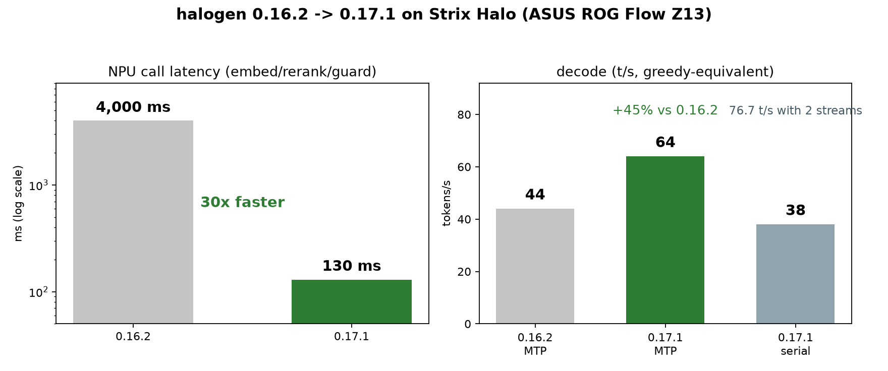

# Benchmark numbers, methodology & what was removed after testing

Rig: ASUS ROG Flow Z13 (Ryzen AI Max+ 395, Radeon 8060S, 128 GB unified, Linux), benches at 70 W sustained. NPU driver needs IOMMU on. Halogen 0.17.1, ling3.0-tiny sidecar on llama.cpp 0.7.6.1-era build.

**NPU microbench (0.17.1, four models resident):**

- Single-query embed: 70ms; rerank: 130ms; guard: 70-130ms
- (on 0.16.2 every NPU call carried ~4s of fixed overhead - 0.16.3's batching fix removed it. If you're on an older release, your NPU numbers are 30x worse than they should be.)
- Decider (binary): 118ms, 78% accuracy (18 realistic prompts)
- Decider (3-option triage): 925ms, 40% accuracy (removed - too biased toward "keep")
- Moderation: 42% recall / 0% fp on 30-prompt canary (ships as tripwire)
- Text gen (qwen3.5-2b): 16.6 tok/s decode (removed - slower than the sidecar)
- LLM decode while NPU works: unchanged (separate silicon)

**Capability eval (20 intent queries, 2 repos, 383k tokens indexed, src-only):**

- NPU semantic (src-only index): 15/20 top-3 correct file
- Ripgrep keyword baseline: 9/20 top-3
- Grep latency: ~2-33s per query

**Near-duplicate scan:** 38 files across 4 repo copies, embedded in 8.4s; found 45 pairs with cosine > 0.90; caught every known duplicate plus a renamed file at 1.000 cosine.

**Keyword-poor task (implement --fail-fast in a smoke script):**

- NPU arm: 6.2 / 11.9 / 9.7 / 26.6 min (mean 13.6, all 4 completed)
- Baseline arm: 24.8 / 16.6 / 14.8 min + 1 failed (25% failure rate)
- Saving: 5.1 min per task, with the caveat that the slowest NPU run barely used the tool

**The invalid experiment I almost published:** my first "controlled experiment" showed a 2x speedup - but the NPU arm never had a working index (path bug), and the task was a public httpx fix the model had memorized (92s, zero search calls). Per-call telemetry caught it, and every tool call now logs its index and query.

## Install & ops

**Install - fully automated, one prompt total.** Clone github.com/aic0d3r/qwen38-strix-halo-harness (tagged v1.0.0, MIT, changelog in the repo) and run `./setup.sh --halogen auto`. It installs pi via npm if missing, pulls the pinned halogen image, and if you don't have the model files it downloads them for you: ~124 GB resumable (that's the one prompt you'll see - it checks your free space first), then the 35 MB portable llama-server for the sidecar, the tiny gguf sha256-verified against Hugging Face, ten extensions, prompt templates, skills, theme, and the systemd keep-alive unit - and your own model entries and pi settings are never touched. `./setup.sh --doctor` verifies every piece with live probes; `./setup.sh --uninstall` backs everything up and returns pi to stock in one command.

**Docker is the one prerequisite** we won't auto-install (system package, needs sudo). First boot pins the 47.7 GiB lookup table from disk, so a few minutes of startup is normal. The launcher pre-flights allocator fragmentation before committing to 262k context and fails in seconds with the exact fix instead of wedging for half an hour, and a 15-min systemd compaction timer keeps the allocator healthy between sessions.

Container image is version-pinned; `scripts/session-audit.sh` runs post-session forensics (cache hit, compaction events, sidecar rejections, NPU index anomalies) and checks the serving version against the pin.
